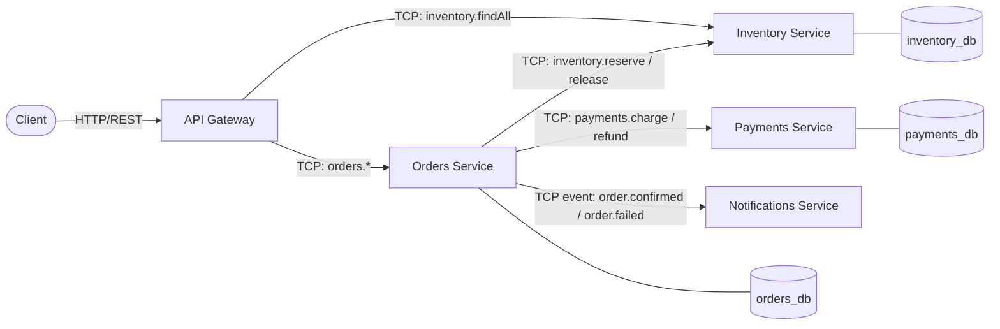

# E-Commerce Microservices Platform

A small but realistic e-commerce backend built as independently deployable
NestJS microservices in TypeScript. It was built as a portfolio project to
demonstrate production-style backend engineering: an API gateway, typed
service-to-service communication, an orchestrated saga with compensation,
database-per-service, containerization, and CI.

## Architecture



- **api-gateway** — the only service exposed to clients. Validates
  requests, forwards them to the owning service, and stays free of business
  logic. Publishes OpenAPI docs at `/docs`.
- **orders-service** — owns order placement. Runs an **orchestrated saga**:
  reserve inventory → charge payment → confirm order, with a compensating
  "release inventory" step if the charge fails.
- **inventory-service** — owns stock levels. Reservations run inside a DB
  transaction with pessimistic row locks to prevent overselling.
- **payments-service** — owns payment capture/refund. Charges are
  idempotent per `orderId` so a retried saga step never double-charges.
- **notifications-service** — a pure event consumer (no database); logs a
  mock notification when it receives `order.confirmed` / `order.failed`.

Every service is a NestJS **hybrid application**: it serves plain HTTP for
`/health` while also listening for TCP microservice traffic
(`@MessagePattern` for request/response, `@EventPattern` for fire-and-forget
events). Swapping the TCP transport for Kafka/RabbitMQ later is a
configuration change in each `ClientsModule`/`connectMicroservice` call, not
a rewrite — that transport abstraction is one of the reasons NestJS scales
well from "demo" to "real" microservices.

Shared code (DTO/event contracts, the global exception filter, the
correlation-id logging interceptor, the TypeORM options factory) lives in
`libs/common` as an internal npm workspace package (`@app/common`), so
producers and consumers share compile-time types for every message instead
of agreeing on a string contract by convention.

## Repository layout

```
apps/
  api-gateway/          REST facade (HTTP only)
  orders-service/        saga orchestrator (HTTP health + TCP)
  payments-service/      payment capture/refund (HTTP health + TCP)
  inventory-service/     stock reservation (HTTP health + TCP)
  notifications-service/ event consumer (HTTP health + TCP)
libs/
  common/                 shared DTOs, filters, interceptors, config helpers
infra/
  postgres-init/          creates one database per service on first boot
docs/
  INTERVIEW_NOTES.md      talking points mapped to the code
```

## Running it

### Docker Compose (all services + Postgres)

```bash
cp .env.example .env
docker compose up --build
```

- Gateway: http://localhost:3000 (Swagger UI at `/docs`)
- Each service also exposes `/health` on its own HTTP port (see `.env.example`).

### Locally, without Docker

Requires a local Postgres reachable with the credentials in `.env.example`.

```bash
npm install
npm run build          # builds libs/common first, then every app
cp .env.example .env && export $(cat .env | xargs)

npm run start:inventory
npm run start:payments
npm run start:notifications
npm run start:orders
npm run start:gateway
```

### Try it

```bash
# Seeded catalog
curl http://localhost:3000/inventory

# Happy path (total <= $5000 passes the demo payment gateway)
curl -X POST http://localhost:3000/orders \
  -H 'Content-Type: application/json' \
  -d '{"items":[{"productId":"sku-001","quantity":2,"unitPrice":25}]}'

# Triggers the saga's compensation path (amount > $5000 is declined,
# and the reserved inventory is released back)
curl -X POST http://localhost:3000/orders \
  -H 'Content-Type: application/json' \
  -d '{"items":[{"productId":"sku-002","quantity":1,"unitPrice":9000}]}'
```

## Tests

```bash
npm test        # unit tests (saga logic lives in orders-service/*.spec.ts)
npm run test:e2e -w apps/api-gateway   # gateway HTTP-layer e2e tests
npm run lint
```

## Notable design decisions

- **Orchestration over choreography** for the saga: `orders-service` is the
  single place that knows the workflow and how to unwind it. Simpler to
  reason about and test than choreography for a 2-3 step saga; choreography
  (each service reacting to the previous one's event) pays off more once
  there are many participants and you want to decouple the orchestrator.
- **Database-per-service**: even though this repo runs one shared Postgres
  container for convenience, each service has its own database and only
  ever touches its own tables — a real deployment would give each service
  its own instance.
- **Optimistic + pessimistic locking**: `inventory_items` uses a
  `@VersionColumn` and reservations take a `pessimistic_write` lock inside a
  transaction, to make the concurrency story explicit for
  interview discussion (what happens if two orders race for the last unit
  of stock?).
- **Idempotent payment capture**: `payments-service` looks up an existing
  captured payment for the same `orderId` before charging, since at-least-once
  delivery is the norm for inter-service calls under retries/timeouts.
- **Docker images are not yet size-optimized** — the runtime stage copies
  the full `node_modules` (including devDependencies) for simplicity. A
  production build would prune dev dependencies or use `npm ci --omit=dev`
  in a dedicated stage.
